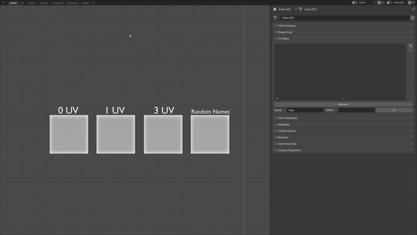
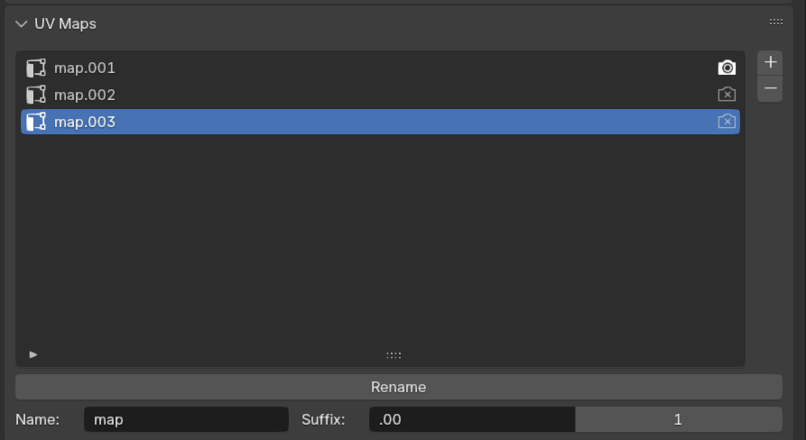

# Batch UV Rename

#### Blender Extension for iterative renaming of multiple UV Maps.

## Installation
* Download `.zip` from the Code Source or Releases.
* Go to `Edit -> Preferences` or press `Ctrl + ,`.
* Select `Get Extentions/Add-ons` Tab.
* Open `Add-ons Settings` and choose `Install From Disk`.

## Features

* **Name**: Identifier(prefix) used per UV Channel.
* **Suffix**: Suffix used per UV Channel. Added to the **Name**.
* **Offset Index**: Start Index of a UV Channel name.
    
    `Start Index = 3. => map3, map4, map5...`